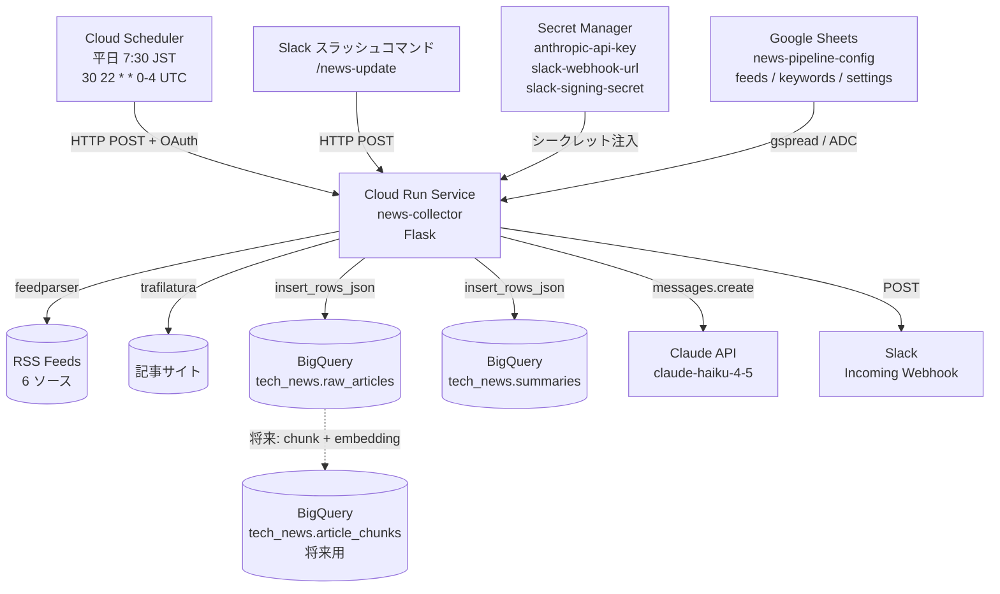
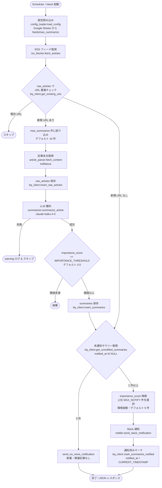
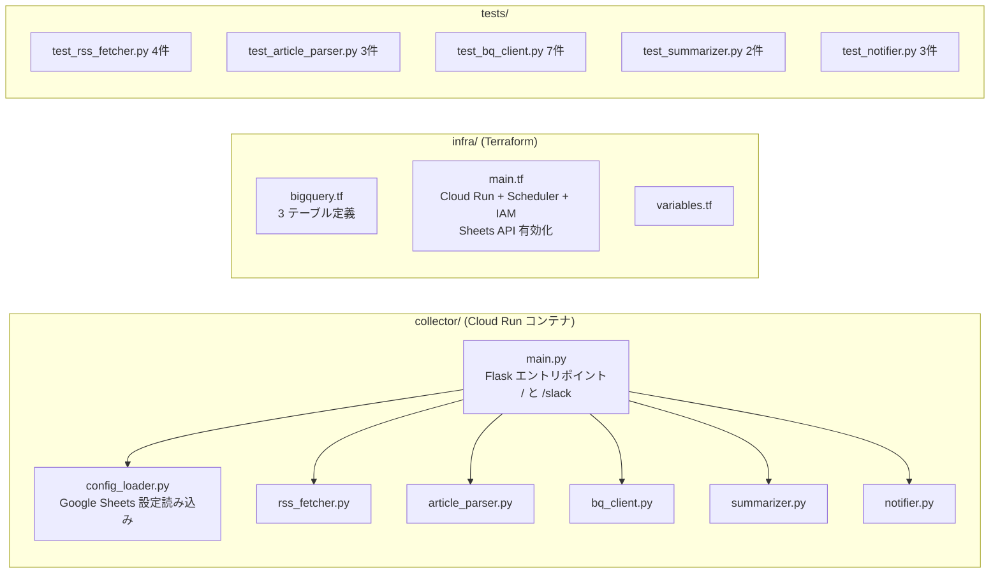
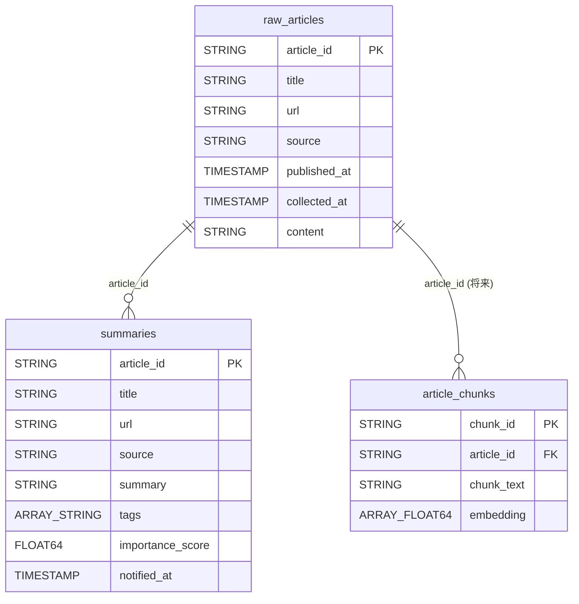
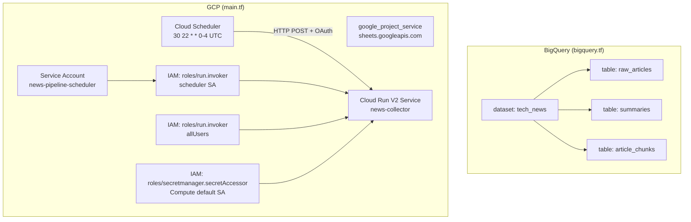
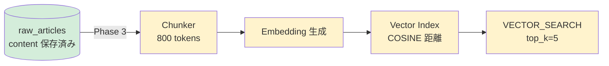

# News Pipeline — アーキテクチャ・実装対応ドキュメント

## 1. システム全体アーキテクチャ

---

## 2. 処理フロー詳細

---

## 3. コンポーネント構成

---

## 4. データモデルと処理の対応

---

## 5. 設計要件と実装の対応表

| 設計要件 | 実装 | ファイル |
|---------|------|---------|
| RSS フィードから記事収集 | `fetch_articles()` / feedparser | `collector/rss_fetcher.py` |
| フィード一覧の外部管理 | Google Sheets feeds シート | `collector/config_loader.py` |
| 重複排除（URL 完全一致・raw_articlesベース） | `get_existing_urls()` → set 差分 | `collector/bq_client.py` |
| 記事本文取得 | `fetch_content()` / trafilatura | `collector/article_parser.py` |
| raw_articles 保存（content 必須） | `insert_raw_articles()` | `collector/bq_client.py` |
| LLM 要約（箇条書き 3〜5 項目） | `summarize_article()` / claude-haiku-4-5 | `collector/summarizer.py` |
| importance_score フィルタ（閾値以上のみ保存） | `IMPORTANCE_THRESHOLD` 環境変数（デフォルト 0.5） | `collector/main.py` |
| summaries 保存 | `insert_summaries()` | `collector/bq_client.py` |
| 未通知サマリー取得 | `get_unnotified_summaries()` / notified_at IS NULL | `collector/bq_client.py` |
| 通知済みマーク | `mark_summaries_notified()` / notified_at 更新 | `collector/bq_client.py` |
| 通知（平日 1 回・最大 MAX_NOTIFY 件） | `send_slack_notification()` + Scheduler | `collector/notifier.py` / `infra/main.tf` |
| ネタ切れ時の通知 | `send_no_news_notification()` | `collector/notifier.py` |
| 記事履歴を BigQuery に保存 | raw_articles / summaries テーブル | `infra/bigquery.tf` |
| RAG 対応（将来） | article_chunks テーブル（空） | `infra/bigquery.tf` |
| 低コスト運用 | Cloud Run Service（cpu_idle=false） + haiku | — |
| Secret 管理 | Secret Manager 経由で ENV 注入 | `infra/main.tf` |
| 手動実行 | Slack スラッシュコマンド `/news-update` | `collector/main.py` |

---

## 6. インフラ構成（Terraform リソース）

---

## 7. 設定管理（Google Sheets）

| シート | 内容 | 変更反映タイミング |
|--------|------|-----------------|
| feeds | RSS フィード URL / ソース名 | 次回パイプライン実行時 |
| settings | max_summarize（デフォルト 10） | 次回パイプライン実行時 |

変更手順：Google Sheets アプリでセルを編集するだけ。デプロイ不要。

環境変数で管理するもの（変更頻度低い・Terraform で設定）：

| 変数 | 用途 | デフォルト |
|------|------|----------|
| `MAX_NOTIFY` | importance_score フィルタ後の通知件数上限 | 5 |
| `IMPORTANCE_THRESHOLD` | summaries 保存・通知対象とする importance_score の閾値 | 0.5 |

---

## 8. 将来の RAG 化パス

> **緑 = 実装済み**（`content` カラムにデータが蓄積される）
> **黄 = Phase 3 で追加予定**
