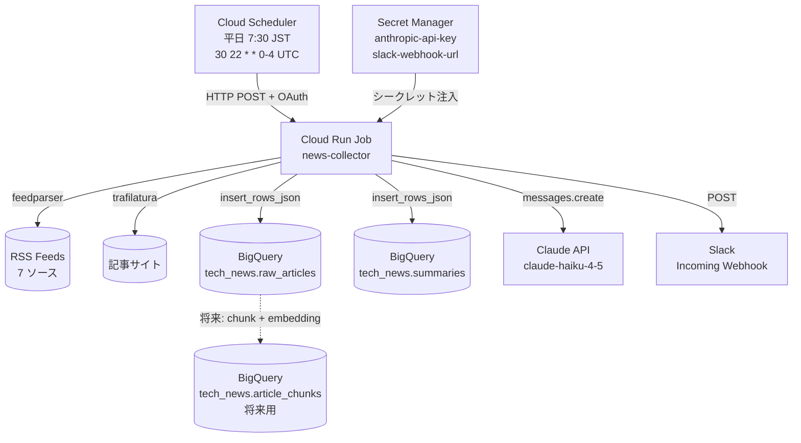
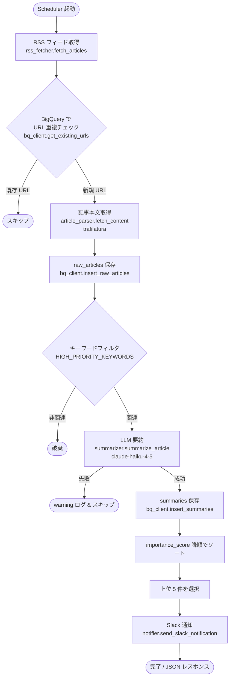
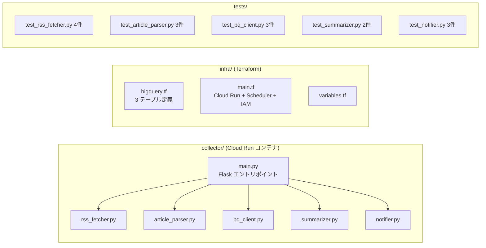
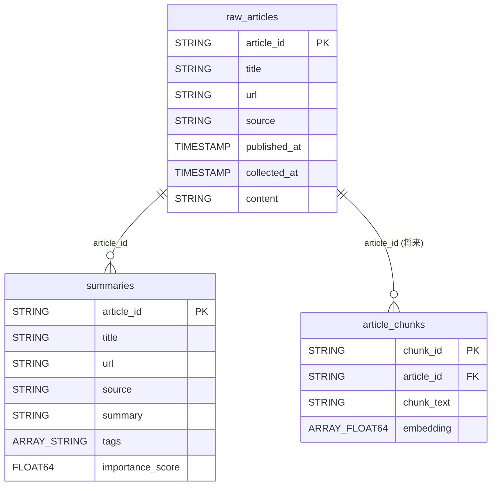
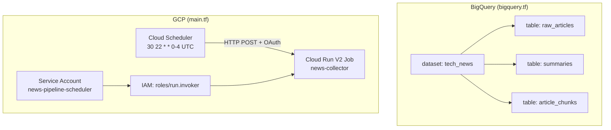
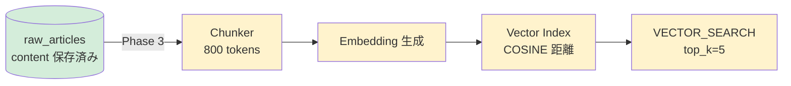

# News Pipeline — アーキテクチャ・実装対応ドキュメント

## 1. システム全体アーキテクチャ

---

## 2. 処理フロー詳細

---

## 3. コンポーネント構成

---

## 4. データモデルと処理の対応

---

## 5. 設計要件と実装の対応表

| 設計要件（requirements doc） | 実装 | ファイル |
|-------------------------------|------|---------|
| RSS フィードから記事収集 | `fetch_articles()` / feedparser | `collector/rss_fetcher.py` |
| 重複排除（URL 完全一致） | `get_existing_urls()` → set 差分 | `collector/bq_client.py` |
| 記事本文取得 | `fetch_content()` / trafilatura | `collector/article_parser.py` |
| raw_articles 保存（content 必須） | `insert_raw_articles()` | `collector/bq_client.py` |
| キーワードフィルタ（高優先度） | `_is_relevant()` / HIGH_PRIORITY_KEYWORDS | `collector/main.py` |
| LLM 要約（箇条書き 3〜5 項目） | `summarize_article()` / claude-haiku-4-5 | `collector/summarizer.py` |
| summaries 保存 | `insert_summaries()` | `collector/bq_client.py` |
| 通知（平日 1 回・最大 5 件） | `send_slack_notification()` + Scheduler | `collector/notifier.py` / `infra/main.tf` |
| 記事履歴を BigQuery に保存 | raw_articles / summaries テーブル | `infra/bigquery.tf` |
| RAG 対応（将来） | article_chunks テーブル（空） | `infra/bigquery.tf` |
| 低コスト運用 | Cloud Run Job（起動時のみ課金） + haiku | — |
| Secret 管理 | Secret Manager 経由で ENV 注入 | `infra/main.tf` |

---

## 6. インフラ構成（Terraform リソース）

---

## 7. 将来の RAG 化パス

> **緑 = Phase 1 で実装済み**（`content` カラムにデータが蓄積される）
> **黄 = Phase 3 で追加予定**

---

## 8. フィルタキーワード一覧

`main.py:21` の `HIGH_PRIORITY_KEYWORDS` で判定。

| 優先度 | キーワード |
|--------|-----------|
| 高（実装済み） | bigquery, dataform, data catalog, data lineage, data governance, google cloud, data modeling |
| 中（Phase 2 追加予定） | dbt, databricks, snowflake, ELT/ETL, データパイプライン, セマンティックレイヤー |
